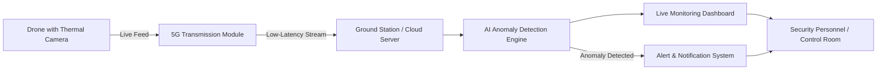

# 🚁 Drone-Based Thermal Anomaly Detection System for Border Security (5G-Enabled)

An intelligent border surveillance system that uses **5G-connected drones** equipped with **thermal imaging cameras** to detect anomalies — such as unauthorized human or vehicle movement — in real time, even in low-visibility and nighttime conditions.

---

## 📌 Table of Contents

- [Overview](#-overview)
- [Problem Statement](#-problem-statement)
- [Proposed Solution](#-proposed-solution)
- [Key Features](#-key-features)
- [System Architecture](#-system-architecture)
- [Tech Stack](#-tech-stack)
- [Prerequisites](#-prerequisites)
- [Installation](#-installation)
- [Usage](#-usage)
- [Project Structure](#-project-structure)
- [Dataset](#-dataset)
- [Anomaly Detection Approach](#-anomaly-detection-approach)
- [Results](#-results)
- [Future Scope](#-future-scope)
- [Team](#-team)
- [Contributing](#-contributing)
- [License](#-license)
- [Acknowledgments](#-acknowledgments)

---

## 🌍 Overview

Border areas are often remote, vast, and difficult to monitor continuously using manual patrolling or fixed CCTV infrastructure. This project proposes a **drone-based aerial surveillance system** that streams live thermal video over a **low-latency 5G network** to a ground station, where an AI model analyzes the feed in real time to flag potential security anomalies and alert response teams instantly.

## 🎯 Problem Statement

- Manual border patrolling is labor-intensive, slow, and limited by terrain and visibility.
- Traditional CCTV/IR cameras are static and have limited coverage.
- Poor lighting, fog, and nighttime conditions reduce the effectiveness of regular optical cameras.
- Delayed detection of intrusions can compromise national security.

## 💡 Proposed Solution

A fleet of drones fitted with **thermal (infrared) cameras** patrols designated border zones, capturing heat-signature video regardless of lighting conditions. The video is transmitted over **5G** for near-zero latency streaming to a ground/cloud server, where a **deep learning model** performs real-time anomaly detection (e.g., human intrusion, unattended objects, vehicle movement) and triggers instant alerts to security personnel via a live dashboard.

## ✨ Key Features

- 📡 **Real-time video streaming** over 5G with ultra-low latency
- 🌡️ **Thermal imaging** for 24/7 operation, including night and low-visibility conditions
- 🤖 **AI-based anomaly detection** (intrusion, unusual heat signatures, unauthorized vehicles)
- 🗺️ **Autonomous/waypoint-based drone navigation** with GPS geo-tagging
- 🚨 **Automated alert system** (dashboard, SMS/email/app notifications)
- 📊 **Live monitoring dashboard** for control room operators
- 🗂️ **Anomaly logging** with timestamp and location for post-event analysis

## 🏗️ System Architecture



## 🛠️ Tech Stack

**Hardware**
- Quadcopter drone frame with flight controller (e.g., Pixhawk/APM)
- Thermal imaging camera (e.g., FLIR Lepton/Boson)
- 5G communication module
- GPS module

**Software / Backend**
- Python (core processing & AI pipeline)
- OpenCV (image/video processing)
- PyTorch / TensorFlow (deep learning model)
- YOLOv8 or custom CNN/autoencoder for anomaly detection
- Flask / FastAPI (backend API)
- MQTT / RTSP / WebRTC (video & data transmission)

**Frontend / Dashboard**
- React.js (or HTML/CSS/JS)
- Chart.js / Leaflet.js (for maps & analytics)

**Database & Cloud**
- MongoDB / Firebase
- AWS / Azure (optional, for cloud deployment)


## 📋 Prerequisites

- Python 3.9+
- Node.js 18+ (if using a web dashboard)
- pip / virtualenv
- Drone hardware with thermal camera and 5G module (or simulated/sample thermal video dataset for software-only demo)

## ⚙️ Installation

```bash
# Clone the repository
git clone https://github.com/<your-username>/<repo-name>.git
cd <repo-name>

# Create and activate a virtual environment
python -m venv venv
source venv/bin/activate      # On Windows: venv\Scripts\activate

# Install backend dependencies
pip install -r requirements.txt

# (Optional) Install frontend dependencies
cd dashboard
npm install
```

## 🚀 Usage

```bash
# Start the anomaly detection backend
python app.py

# Start the dashboard (in a separate terminal)
cd dashboard
npm run dev
```

1. Connect the drone's 5G streaming module to the backend endpoint.
2. The AI engine processes the incoming thermal feed frame-by-frame.
3. Detected anomalies are logged and pushed to the live dashboard.
4. Alerts are sent to configured notification channels.

## 📁 Project Structure

```
├── drone-control/          # Drone navigation & flight control scripts
├── thermal-streaming/      # 5G video capture & streaming modules
├── ai-model/                # Anomaly detection model, training & inference
│   ├── dataset/
│   ├── train.py
│   └── inference.py
├── backend/                 # API server, alert system
├── dashboard/                # Frontend monitoring dashboard
├── requirements.txt
└── README.md
```

## 📊 Dataset

- Thermal image/video dataset used for training the anomaly detection model (e.g., public thermal datasets like **FLIR ADAS**, **OSU Thermal Pedestrian Dataset**, or a custom-collected dataset).
- Preprocessing: frame extraction, normalization, and annotation for supervised/unsupervised training.


## 🧠 Anomaly Detection Approach

- **Object detection-based:** Fine-tuned YOLO model to detect humans/vehicles in thermal frames.
- **Unsupervised anomaly detection:** Autoencoder trained on "normal" thermal patterns; frames with high reconstruction error are flagged as anomalies.
- Post-processing includes confidence thresholding and geo-tagging of detected anomalies.

## 📈 Results

| Metric | Value |
|---|---|
| Detection Accuracy | TBD |
| False Positive Rate | TBD |
| Average Latency (5G stream to alert) | TBD |

Add sample thermal frames, detection screenshots, or a demo video/GIF here.

## 🔮 Future Scope

- Swarm-based multi-drone coordination for wider coverage
- Edge AI deployment on the drone itself to reduce dependency on network latency
- Integration with satellite imagery for broader situational awareness
- Predictive analytics for anticipating intrusion patterns

## 👥 Team

| Name | Role |
|---|---|
| Yash Raj | TBD |
| Akshit Kumar | TBD |
| Prashant Pratap Singh | TBD |

**Institution:** Birla Institute of Technology, Mesra

## 🤝 Contributing

Contributions are welcome! Please fork the repository, create a feature branch, and submit a pull request.

## 📄 License

This project is licensed under the [MIT License](LICENSE).

## 🙏 Acknowledgments

- Sanjeet Kumar, ECE | BIT Mesra
- Open-source thermal imaging datasets and research referenced during development
